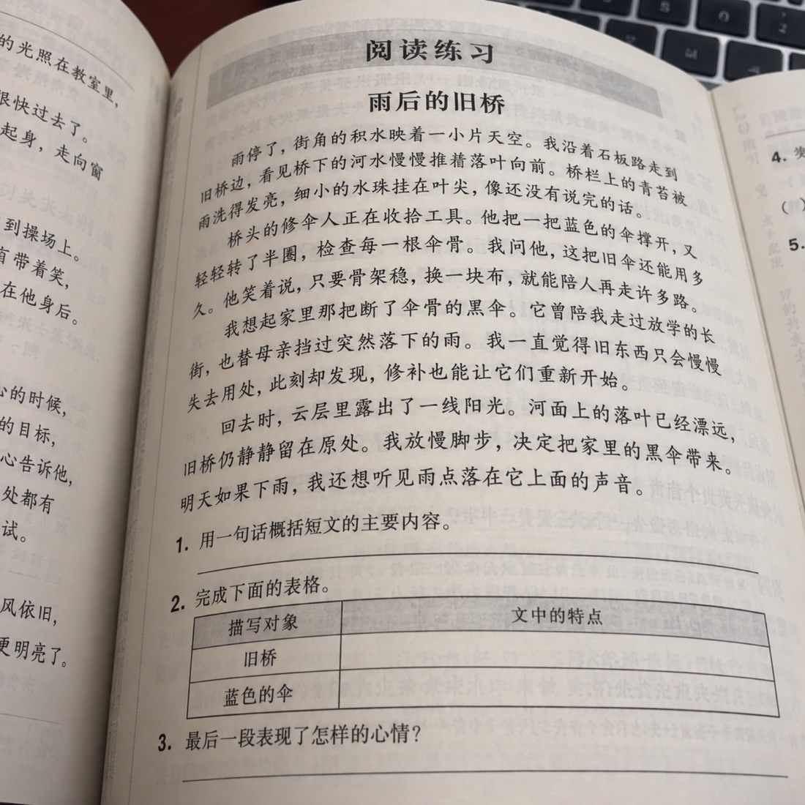
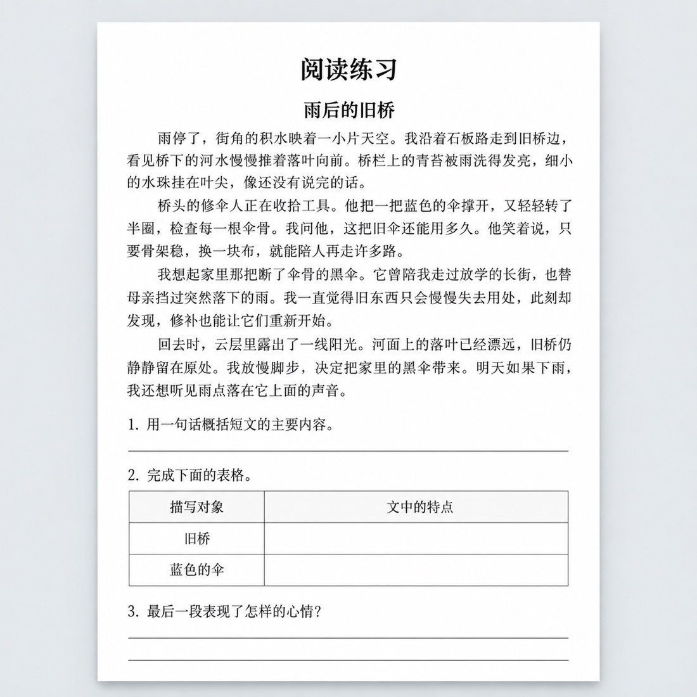
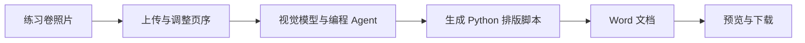

<div align="center">

# PaperForge

### 拍下练习卷，把排版交给 AI

将纸质练习卷照片整理成 **可编辑、可打印的 A4 Word 文档**。

**[在线使用](https://paperforge.lcasj.top) · [自行部署](#自行部署) · [模型配置](#模型配置) · [部署架构](docs/self-hosting.md)**


</div>

---

## 它能做什么

给 PaperForge 一组练习卷照片，它会识别文字与题目结构，生成 Word 文档。下载后可以在 Word 或 WPS 中核对、修改和打印。

| 输入 | 处理 | 输出 |
| :--- | :--- | :--- |
| JPG / PNG 照片，每次最多 20 张 | 按上传顺序识别、转录和排版 | 一份可编辑的 `.docx` |
| 表格、材料、诗歌、注释 | 按内容结构设置段落与表格 | A4 页面、中文字体与答题横线 |
| 几何图、坐标图等题目插图 | 从照片裁切并嵌入对应位置 | 文字可编辑，插图保留为图片 |

支持调整上传页序、查看生成进度、在线预览和下载。生成期间关闭页面后，可以通过保存的任务链接继续查看。

> 识别质量取决于照片和模型。打印前请核对文字、公式、插图与分页；网页预览不等同于 Word 的真实分页。

## 效果示意

<table>
<tr><th>拍摄照片</th><th>排版效果</th></tr>
<tr>
<td></td>
<td></td>
</tr>
</table>

上图为 AI 生成的原创虚构练习示意，**不是实际转换结果或识别准确率证明**。

## 在线使用与自行部署

**想直接使用：** 访问 [PaperForge 在线版](https://paperforge.lcasj.top)。在线服务的账号、额度与使用规则以站内说明为准。

**想自己配置：** 部署本仓库，连接你自己的视觉模型 API。自部署不依赖在线版账号或在线版额度；模型调用、服务器与维护成本由部署者承担。源码采用 MIT 许可证。

## 自行部署

### 1. 准备环境

- Node.js **22 或更新版本**（项目使用 `node:sqlite`）。
- Python **3.9 或更新版本**。
- 支持图片输入及工具调用的模型 API。
- `pi` 编程 Agent CLI；当前容器固定使用 `0.99.2`。

下面是用于个人开发与验证的本地启动方式。Agent 会执行生成的 Python 代码，公开服务请使用隔离的任务容器，见 [部署架构](docs/self-hosting.md)。

```bash
git clone https://github.com/FlashingChen/Paper-Forge.git
cd Paper-Forge
npm ci
npm install -g @earendil-works/pi-coding-agent@0.99.2
PAPERFORGE_VENV="$PWD/.venv" bash scripts/setup-venv.sh
cp .env.example .env
```

### 2. 填写配置

编辑 `.env`，至少设置：

| 配置项 | 用途 |
| :--- | :--- |
| `SESSION_SECRET` | 会话签名及模型密钥加密；使用独立随机值 |
| `ADMIN_USERNAME` | 首次启动的管理员用户名 |
| `ADMIN_PASSWORD` | 首次启动的管理员密码，至少 8 位 |
| `PAPERFORGE_PROVIDER` | 模型提供方标识 |
| `PAPERFORGE_BASE_URL` | 你所使用的模型接口地址 |
| `PAPERFORGE_MODEL` | 支持视觉输入的模型名称 |
| `PAPERFORGE_API_KEY` | 你自己的模型 API 密钥 |

生成会话密钥：

```bash
openssl rand -base64 32
```

设置本次启动使用的 Python 并启动：

```bash
export PAPERFORGE_PYTHON="$PWD/.venv/bin/python"
npm run dev
```

在浏览器打开本机的 3000 端口。使用配置的管理员账号登录，进入后台检查模型配置，再上传一张有合法使用权的练习卷测试。

### 模型配置

后台「模型配置」中保存的值优先于环境变量。可以自行设置 provider、接口地址、模型名称、API 密钥及视觉能力，保存后使用「测试连接」。**连接成功只证明接口可访问，还需要实际生成验证。**

模型必须支持图片输入和 Agent 使用的工具调用；纯文本模型不适用。若使用自定义 OpenAI 兼容接口，应填完整接口地址、实际模型名称，并在后台明确视觉能力。提供方声明也可由 pi 的 `models.json` 配置。

本地开发可能读取已有 pi 凭据；部署时请显式配置密钥，不要把个人凭据文件放进源码或镜像。

### 账号与额度

管理员账号在第一次启动时创建；之后修改环境变量不会重置已有账号。个人使用可以直接登录管理员账号。

多用户场景支持注册申请、人工审核和额度管理。自部署管理员可以创建用户、审批申请并设置额度。这些额度仅属于你自己的实例，不与在线服务同步。

## 工作原理



项目使用 Next.js 提供页面与 API，SQLite 保存账号、任务状态及用量。Agent 读取照片，编写并执行 `python-docx` 脚本，检查结果后交付文档。

公开部署采用独立执行节点：控制面管理账号与任务，节点管理器创建隔离任务容器，模型网关代理任务的模型请求。详见 [自部署架构与配置](docs/self-hosting.md)。

## 数据与隐私

- 照片、生成文档、数据库、任务日志及实际环境配置属于运行数据，不包含在本仓库中。
- 密码保存为哈希；后台保存的模型 API 密钥经过加密。请保持会话密钥稳定并做好备份。
- 图片会发送至你配置的模型服务，具体数据处理规则由该服务决定。
- 上传内容应由你拥有权利或获得合法使用授权。
- 收款码默认不提供；如需自愿赞助入口，可自行配置站内图片路径。赞助入口不是购买额度的支付系统。

## 开发与验证

```bash
npm run typecheck
npm run test:unit
.venv/bin/python -m unittest discover -s tests
npm run build
```

生成结果可另外运行离线排版检查：

```bash
.venv/bin/python scripts/verify.py <你的文档.docx>
```

此检查验证部分版式规则，不证明题目转录完整或文字识别正确。

## 项目结构

| 目录 | 内容 |
| :--- | :--- |
| `src/app` | 页面、账号与任务 API、管理后台 |
| `src/components` | 上传、进度、预览组件 |
| `src/lib` | 认证、数据库、模型配置及执行调度 |
| `agent` | 文档生成指令与排版助手 |
| `scripts/execution` | 节点管理器、任务 worker 与模型网关 |
| `scripts` | 环境准备、文档预览与检查工具 |
| `tests` | TypeScript 和 Python 测试 |
| `reference` | 原创版式参考文档 |

## 当前边界

- 当前没有用户任务历史列表，请保存任务链接。
- 生成失败需要重新上传；当前并非所有运行失败都会自动返还实例额度。
- 复杂公式和版面需要人工核对；插图使用裁切图片，不能逐元素编辑。
- 本仓库不包含在线服务的实际配置、数据、收款系统或可用的模型密钥。

## 许可证

项目源码采用 [MIT License](LICENSE)。第三方依赖遵循各自许可证；源码许可不授予第三方模型 API、上传材料或在线服务的使用权。
